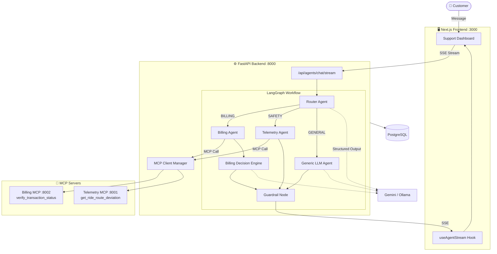
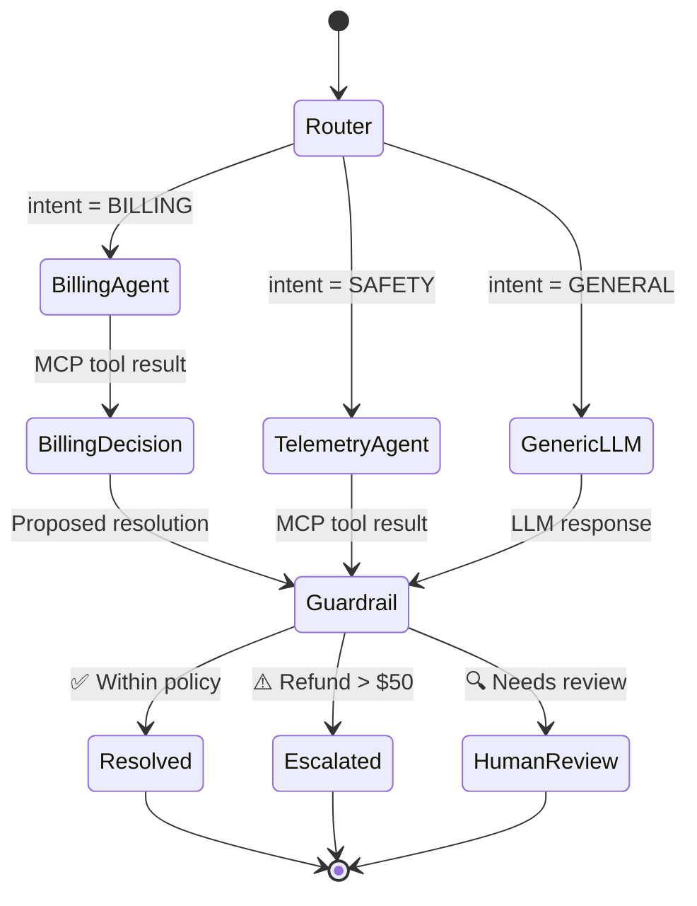

<p align="center">
  <h1 align="center">AssistFlow</h1>
  <p align="center">
    <strong>Multi-Agent Customer Support Platform powered by LangGraph & MCP</strong>
  </p>
  <p align="center">
    <a href="#quick-start">Quick Start</a> · <a href="#architecture">Architecture</a> · <a href="#tech-stack">Tech Stack</a> · <a href="#api-usage">API</a>
  </p>
</p>

---

AssistFlow is an autonomous support platform for ride-hailing businesses. It uses a **multi-agent LangGraph workflow** to classify tickets, fetch real-time operational data via the **Model Context Protocol (MCP)**, and produce policy-validated resolutions — all streamed live to a Next.js dashboard.

## Key Features

- **Intelligent Routing** — LLM-powered triage classifies intent (`BILLING` / `SAFETY` / `GENERAL`) with urgency scoring (1–5) using structured outputs
- **MCP Tool Integration** — Agents autonomously discover and invoke external tools at runtime for transaction verification and ride telemetry
- **Policy Guardrails** — Deterministic resolution engine enforces refund limits, escalation rules, and Pydantic-validated action schemas
- **Real-Time Streaming** — SSE endpoint streams token-by-token responses, agent state transitions, and tool invocations to the frontend
- **Live Observability Dashboard** — Split-pane UI shows the chat alongside agent thinking states, MCP lookups, and structured evidence panels

## Architecture

### System Overview



### Agent Decision Flow



## Tech Stack

| Layer | Technology |
|-------|-----------|
| **Agents** | LangGraph, LangChain, Gemini / Ollama |
| **Backend** | FastAPI, Pydantic v2, SQLAlchemy (async), Alembic |
| **Frontend** | Next.js (App Router), TypeScript, Tailwind, Shadcn UI |
| **Protocol** | Model Context Protocol (MCP) via FastMCP SDK |
| **Database** | PostgreSQL 16 |
| **Infra** | Docker Compose (6 services), GitHub Actions CI |
| **Quality** | Ruff, Pytest, ESLint, Vitest, Structlog |

## Project Structure

```
support-ai/
├── backend/                 # FastAPI + LangGraph agents + MCP client
│   ├── app/
│   │   ├── agents/          # Graph, nodes (router, billing, telemetry, guardrails)
│   │   ├── api/             # REST + SSE streaming endpoints
│   │   ├── db/              # SQLAlchemy models, migrations
│   │   └── mcp_client.py    # MCP tool discovery & invocation
│   └── tests/
├── frontend/                # Next.js support console
│   └── app/                 # Dashboard with live agent observability
├── mcp-servers/
│   ├── billing/             # verify_transaction_status tool
│   └── telemetry/           # get_ride_route_deviation tool
└── docker-compose.yml       # Full-stack orchestration (6 containers)
```

## Quick Start

### Prerequisites

- Docker & Docker Compose
- Google API key _or_ Ollama for local LLM inference

### One command setup

```bash
cd support-ai
docker-compose up --build
```

| Service | URL |
|---------|-----|
| Frontend | [localhost:3000](http://localhost:3000) |
| Backend API | [localhost:8000/docs](http://localhost:8000/docs) |
| Telemetry MCP | localhost:8001 |
| Billing MCP | localhost:8002 |

### Local Development

```bash
# Backend
cd backend && uv sync && uv run uvicorn app.main:app --reload

# Frontend
cd frontend && npm install && npm run dev
```

## 📡 API Usage

**Stream an agent response:**
```bash
curl -N -X POST http://localhost:8000/api/agents/chat/stream \
  -H "Content-Type: application/json" \
  -d '{"message": "I was charged twice for transaction txn_123"}'
```

**List discovered MCP tools:**
```bash
curl http://localhost:8000/api/mcp/tools
```

**Invoke a tool directly:**
```bash
curl -X POST http://localhost:8000/api/mcp/invoke \
  -H "Content-Type: application/json" \
  -d '{"tool_name": "verify_transaction_status", "input": {"transaction_id": "txn_123"}}'
```

## Environment Variables

| Variable | Default | Description |
|----------|---------|-------------|
| `GOOGLE_API_KEY` | — | Gemini API key (not needed if using Ollama) |
| `USE_OLLAMA` | `True` | Use local Ollama instead of Gemini |
| `OLLAMA_MODEL` | `gemma4:12b` | Ollama model name |
| `DATABASE_URL` | `postgresql+asyncpg://...` | Async database connection string |

## Testing

```bash
# Backend (mocks LLM + MCP — no API key needed)
cd backend && uv run pytest

# Frontend
cd frontend && npm run test:run
```

## License

MIT
